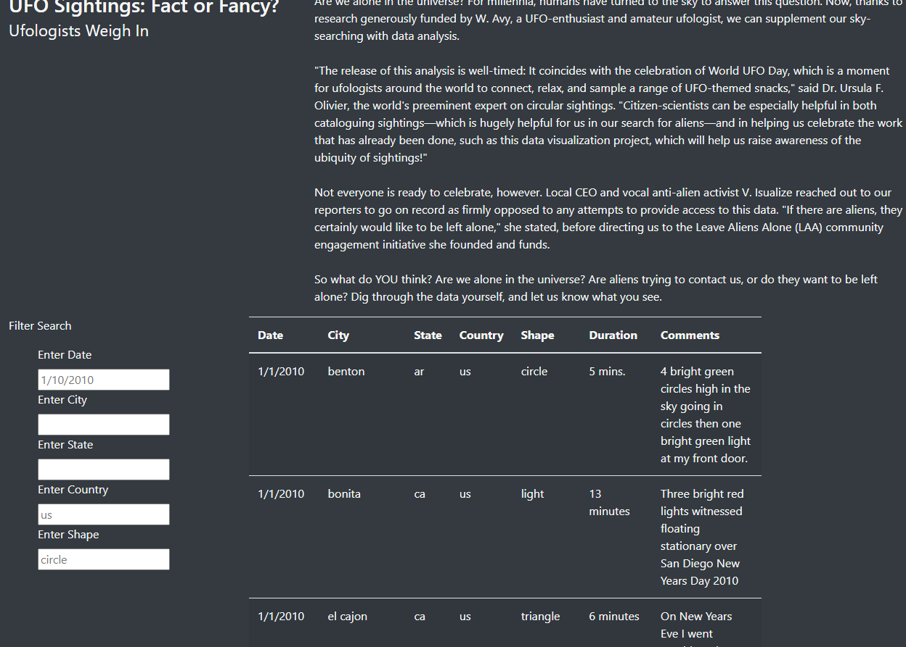
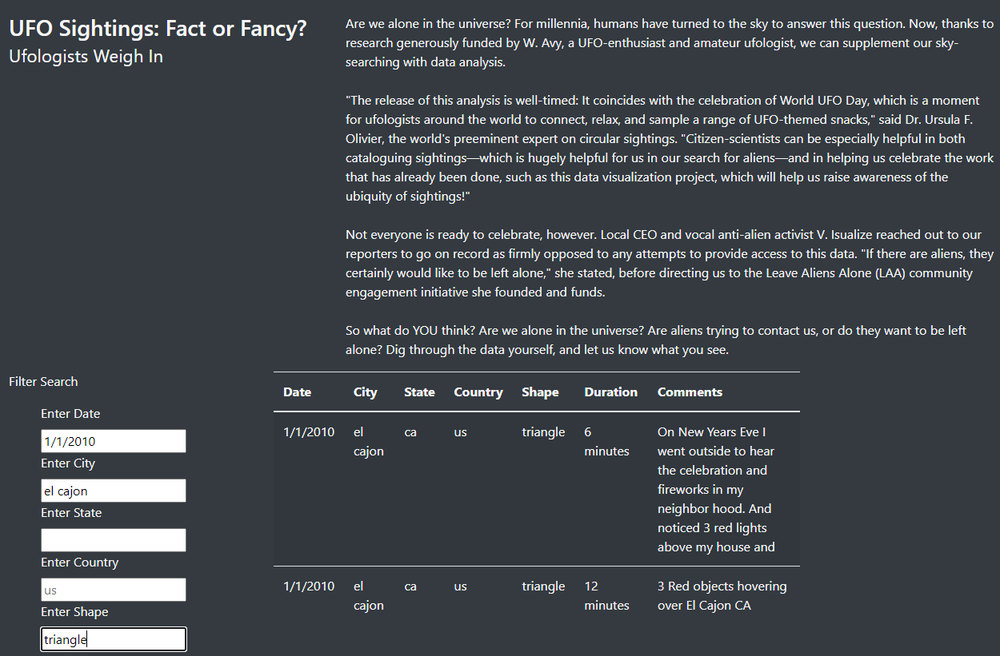

# UFO Webpage 

## Contents
- [Overview of the Project](#overview)
- [Files](#files)
- [Results](#results)
- [Summary](#summary)

## Overview
The project deals with creating a webpage that contains details of UFO sightings over several days. The objective is to make the page interactive by providing the user with the option to enter specific filter criteria, which will then be used to return specific sightings that fit the criteria. 

## Files
- app.js  - Contains the javascript code used in the challenge
- data.js - Contains the UFO sightings data in javascript format
- index.html - Contains the html code for the webpage

## Results

The end result is a webpage that contains the sightings data with optins for multiple filters. The following steps can be used to filter sightings based on user criteria"

1. Refresh the webpage to display all UFO sightings. Note that the filter input boxes already have placeholders that are displayed. The image below shows the page once refreshed:

2. Enter filters as needed. Even filters with placeholders will need to be typed over. Once a filter criterion has been enetered, hit the 'Return' key. Enter as many filters as needed, each time hitting the 'Return' key. The sightings list will update as shown below:

3. Refresh the page to reset all filters

## Summary

A webpage with UFO sightings data was constructed. However, the page certainly has some drawbacks and room for improvement as described below: 

### Drawbacks

Below are two drawbacks of the page:

1. The filter placeholders themselves cannot be directly be used as filter criteria. To a new user, it is not very obvious that the text in the filter box is just a placeholder.

2. The placeholder cannot be edited or deleted. In other words, the user has to type over the placeholder and hit 'Return' for the page to update.

### Recommendations

1. Include a button to filter the webpage based on multiple criteria all at one time, rather than filtering by one criterion at a time. 

2. Provide tooltips when user rolls the mouse over the text box to make the page more intuitive.
